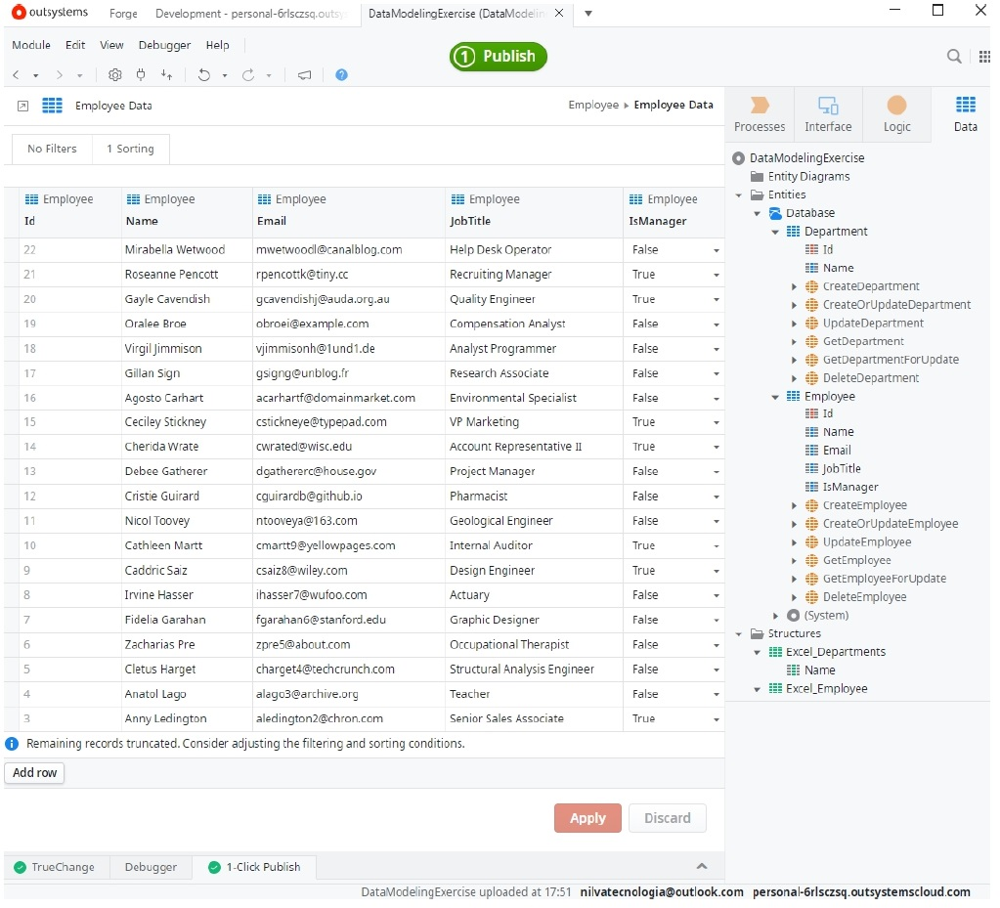

# Data Modeling Exercise

## Objetivo:
    Este exercício foi proposto para praticar a criação de Entidades no OutSystems e familiarizar com o ambiente de desenvolvimento Service Studio.

### Conhecimentos aplicados:

1 - Criar  Reactive Web App, adicionar módulo em branco, adicionar imagem;

2 - Criar nova Entidade e definir formatação;

3 - Importar Entidades do Excel(automaticamente) e outra de forma Manual

4 - Inicializar os dados utilizando o Bootstrap

### Registro Fotográfico

### Developer 

[ **Nilva Pires**](https://github.com/nilva2020)   

---

🔸Projeto Bootcamp OutSystems 🔸BePRO Instituto 🔸Agosto 2024

